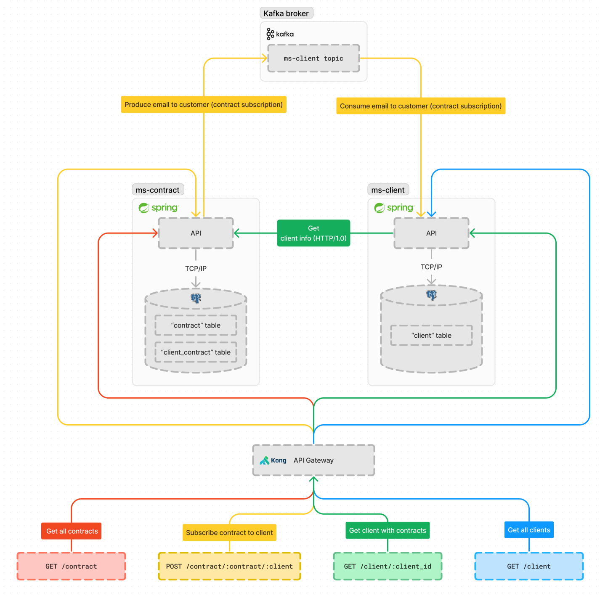

# Insurance microservice architecture
POC of a microservice architecture for an insurance company (customer and contract management) integrating synchronous & asynchronous communication.



## Tech stack
- [Spring](https://spring.io)
- [PostgreSQL](https://www.postgresql.org)
- [Kafka](https://kafka.apache.org)
- [Kong](https://konghq.com/products/kong-gateway)
- [Docker](https://www.docker.com)

## Get started
1. Start Docker engine
2. Launch microservices and Kafka using Docker compose
    ```
    docker compose up --build
    ```

## Endpoints
[JSON Postman collection here](Insurance-microservice-architecture.postman_collection.json)<br/>
List of all endpoints:
- `GET http://localhost:8000/contract` Get all contracts
- `GET http://localhost:8000/client` Get all clients
- `GET http://localhost:8000/client/be57a327-c93b-41c7-97dd-64190bfe1a23` Get one client with contracts by ID
- `POST http://localhost:8000/contract/{contract_id}/{client_id}` Save a new contract by client ID

## License
This project is licensed with GNU AGPL v3 License.</br>
See [LICENSE](./LICENSE) for more details.